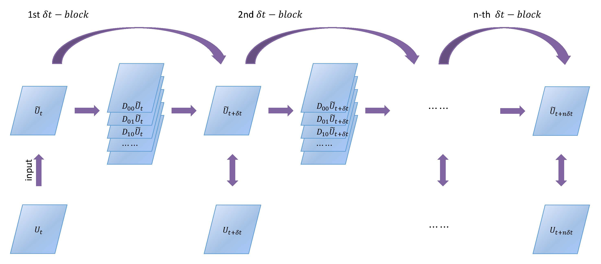

# PDE-Net

This is the code for the paper

[PDE-Net 2.0: Learning PDEs from Data with A Numeric-Symbolic Hybrid Deep Network](https://arxiv.org/abs/1812.04426)<br />
[Long Zichao](https://scholar.google.com/citations?user=0KXcwnkAAAAJ&hl=zh-CN), [Lu Yiping](https://web.stanford.edu/~yplu/), [Dong Bin](http://bicmr.pku.edu.cn/~dongbin)

<div  align="center">

</div>

If you find this code useful in your research then please cite
```
@article{long2019pde,
  title={PDE-Net 2.0: Learning PDEs from data with a numeric-symbolic hybrid deep network},
  author={Long, Zichao and Lu, Yiping and Dong, Bin},
  journal={Journal of Computational Physics},
  pages={108925},
  year={2019},
  publisher={Elsevier}
}
```

# Setup

All code were developed and tested on CentOS 7 with Python 3.7, and were implemented by pytorch 1.1.0

The code are based on **A** Py**T**orch **E**xtension for **A**pplied **M**athematics [aTEAM](https://github.com/ZichaoLong/aTEAM).
The easiest way to download a proper version of aTEAM for PDE-Net 2.0 is to use git submodule tools.

For example, you can create a conda environment and set up PDE-Net 2.0 like this:

```bash
conda create -n PDE-Net-2 python=3.7 scipy pyyaml jupyter matplotlib
source activate PDE-Net-2
conda install pytorch=1.1 torchvision cudatoolkit=9.2 -c pytorch
git clone git@github.com:ZichaoLong/PDE-Net.git
cd PDE-Net
git checkout PDE-Net-2.0 # switch your branch from 'master' to the 'PDE-Net-2'
git submodule init
git submodule update
```

In addition, insead of applying PDE-Net (2.0) directly to your own problems, 
we recommand you to build your own codes upon the basic extension library 
[aTEAM](https://github.com/ZichaoLong/aTEAM) for further reseach.


# Usage

| Model                                  | example of config file                     | 
| ---                                    | ---                                        | 
| Burgers' Equation                      | checkpoint/burgers-noise0.001/options.yaml | 
| Diffusion Equation                     | checkpoint/heat-noise0.001/options.yaml    | 
| Reaction Convection Diffusion Equation | checkpoint/cdr-noise.0.001/options.yaml    | 

The following documents are mainly take Burgers' equation for explaining. 
The usage for diffusion equation and CDR (convection diffusion with reactive source) equation 
is similar to Burgers' equation (Change `dataname='burgers'` to `dataname='heat'` or `dataname='cdr'`).

## Training

- Default options can be found in conf.py, see conf.default_options.

- Method1: Configure training by command line options (terminal interface):
```bash
dataname="burgers"
constraint=2
kernel_size=5
stablize=0
sparsity=0.005
scheme=upwind
momentsparsity=0.001
viscosity=0.05
noise=0.001
data_start_time=1
hidden_layers=5
casename=${dataname}-${constraint}-${scheme}-sparse${sparsity}-noise${noise}
python train.py \
    --name=${casename} \
    --dataname=$dataname --constraint=${constraint} --device=cuda:0 \
    --kernel_size=${kernel_size} --viscosity=${viscosity} --blocks=0-6,9 \
    --start_noise=${noise} --end_noise=${noise} \
    --stablize=${stablize} --sparsity=${sparsity} --momentsparsity=${momentsparsity} \
    --data_start_time=${data_start_time} --dt=1e-2 --max_dt=1/1600
```
Training information and learned parameters will be stored in `checkpoint/${casename}`.

- Method2: Retrain an existing case for more blocks, and start from block 9:
```bash
N=3
python train.py --name=${casename} --configfile=checkpoint/${casename}/options.yaml \
    --start_from=${N} --blocks=12,15,18,21,24,27,30,35,40
```

- Method3: Configure your case first and then train it:
```bash
cp -r checkpoint/burgers-noise0.001 checkpoint/test
# modify checkpoint/test/options.yaml and then exit
python train.py --name=test --configfile=checkpoint/test/options.yaml
```

- For more examples about training please refer to `${dataname}job.slurm,${dataname}manytrain.slurm`, where `dataname=burgers or heat or cdr`

## Test
We should generate data first before we test the learned model.
`./burgersdatafortest.slurm` will generate test data according to the default configuration file `checkpoint/burgers-noise0.001/options.yaml`. 
Please change this parameter in `burgersdatafortest.slurm` if needed.
**NOTICE**: Please make sure your configuration of the test data is as the same as your learned model.
Then test your learned case:
```bash
for ((i=0;i<20;i++)) do
    # test on i-th batch of test data and store the results in checkpoint/$casename
    python _test.py $casename $i
done
# aggregate errors of 20 batches of test data, remove tmporary results
python test.py $casename 20
```
Then the testing results will be stored in `checkpoint/$casename/errs`. 
See `burgerscompareerrs.py` to visualize your results.

**TIPS**: Try to run `./burgersdatafortest.slurm; ./burgersjob.slurm; ./burgerserrs.slurm` in a workstation with 4 GPUs.

## Learn more details about your trained model
We highly recommand you to refer to ${dataname}debug.py, 
and run the code line by line in an interactive python IDE (e.g. Jupyter Notebook or IPython).
You can set your options term by term (include parameters of symnet), load a trained model, print coefficient of SymNet.

